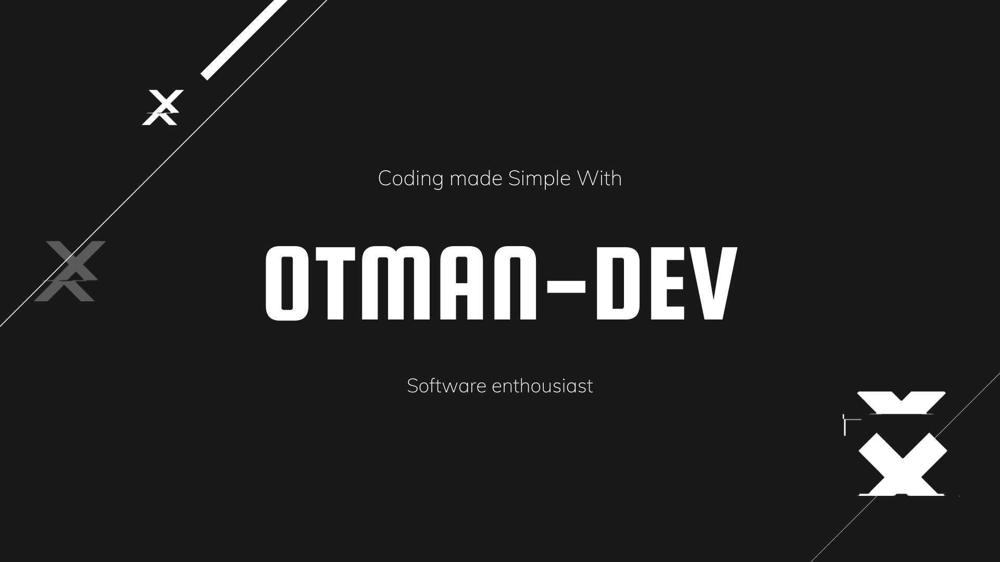

<!---->
<!---->

  

# Hi there 👋

- 🌱I m looking forward to learn JS frameworks and Python Wonderful Utilities and librarys While using github, for all who s intrested for further Information about that I invite you to check my repositories !!
and for all who are on an advance level, feel free to join and check my activities and i ll be greatfull for any suggestions !!

- 👯I would love some company From people with my same level and same intrests to collaborate and upgrade together while working remotely .

- 💬 Ask me about ...
I would love to share all i Know about C PYTHON JS PHP also ARDUINO HTML and CSS !

## 🤜🏻🤛🏻 Support Me

You can support me , if follow all my social networks easy and there is no better  . 🙏🏻
- 😄 Pronouns: ...
- ⚡ Fun fact: ...

  

 

  

